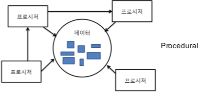
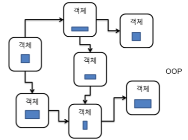
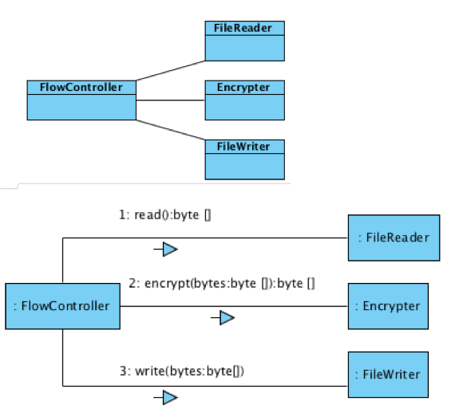
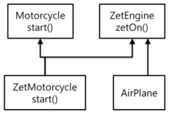
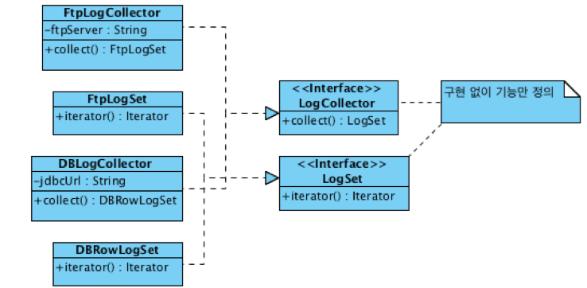

[TOC]


# 클린코드

> 코드 1개의 라인을 고치면 3개의 버그가 발생한다.
>
> 프로그래밍을 짤 때 계획하고 작성하는 코드와 그렇지 않고 작성하는 코드는 수정 시간은 뒤로 갈수록 차이가 난다.
>
> SW는 작성하게 되면 최소 10번 이상 읽힌다.

**우리는 이를 통해 알 수 있듯이, 프로그램이 돌아가는 것에 초점을 맞추지 말고 어떻게 하면 "읽기" 좋은 코드를 짜는지에 시간을 투자하고 계획해야한다.**


### 왜 OOP일까?



데이터가 한곳에 모여져있는, 결합도가 낮고 응집도가 높은 코드이다. (설계X)

이런 코드는 데이터가 필요해서 기존것을 복사, 붙여 넣을때 오류가 발생시 어디에서 오류가 나고 있는지 유지, 보수가 힘들다




각 객체마다 의존성 즉 다른 객체에 대해서 존재도 모르게 코드를 짜게 될 경우 수정이 필요하거나 추가가 필요할 경우 소스를 전체적으로 수정해야하는 기족의 방식과는 다르게 필요한 부분만 수정이 가능하다.

가장 이상적인 결합도는 높도, 응집도는 낮은 프로그램이다.


### 이상적인 객체지향 설계과정

우리가 추구해야 하는 설계 방향은 모든 기능을 한 곳에 전부 넣어서 개발하는 식의 막코딩이 아니라, 각 기능마다 추출을 해서 결합도를 나춰주는 과정을 거쳐 가면서 **리펙토링**을 해야한다.

물론 처음부터, 완벽한 설계를 하면 좋지만, 백지에서 완벽한 프로그램 설계를 만들어내는 것은 너무 어려운 일이다.

1. 기능을 제공할 객체 후보 선별
   1. 내부에서 필요한 데이터선별
   2. 클래스 다이어그램
   3. 정적 설계
2. 위에서 만든 데이터를 가지고 있는 클래스간에 메시지 흐름 연결
   1. 커뮤니케이션 다이어그램
   2. 시퀀스 다이어그램
   3. 동적 설계



위 그림처럼 FlowController에 모든 역활을 집어 넣지 않고 모두 각 역활마다 클래스를 만든다.

위의 그림이 완성 됐으면, 아래 그림처럼 데이터의 흐름을 계획한다.

예시처럼 FlowController는 각 역활 별로 데이터를 보내주는 역활이다.


### Encapsulation(캡슐화)

객체지향에서 대표적인 특성중에 하나인 캡슐화는 내부적으로 어떻게 구현했는지를 감춰서 내부의 변경(데이터, 코드)이 Client가 변경 되지 않도록한다.

이는 코드 변경에 따른 비용을 최소화 시켜준다.

절차지향은 요구사항이 변경  될때마다 데이터의 구조가 변경 되어야하고 이는 모든 Client, Test의 수정이 필요해 지기 때문에 유지보수성이 떨어진다.


#### How? Tell! Don't ask!!

캡슐화가 잘되었다는 것은 데이터를 잘알고 있는 객체가 있다는 거고 그 객체에게 기능을 수행하게 해야 한다. 직접적으로 데이터를 요청해서 변경하는 것은 무엇이 아닌 어떻게 정의하려하는 것이다.

ex. If(member.getExpiredData().getTime() < System.currentTimeMillis){...}

if(member.isExpired()){...}

이런 식으로 명령만 내리게 객체를 정의 해야한다.


### 객체 / 클래스

좋은 코드는 각 역활에 맞게 알맞은 이름과 이름에 맞는 기능이다.

그럼 우리는 이름을 어떻게 짓느냐에 많은 시간을 투자 해야한다. 객체, 클래스는 어떻게(How)로 정의하지 않고, 무엇(What)으로 정의해야 한다. 객체와 클래스는 책임을 가지는 역활이기 때문이다. 

예를 들어 SamsungSmartPhone이 아닌 SmartPhone이 되어야 한고, 도서관 사서라는 객체를 만든다면, 책관리, 도서관 관리하는 책임이 사서라는 역활에 속해 있다.

- Object
- Role
- Responsibility


### Polymorphism(다형성)



> 한 객체는 여러가지(poly) 모습(morph)을 가질 수 있다.
>

```java
ZetMotorcycle zm = new ZetMotorcycle();
Motorcycle mc = zm;
ZetEngine ze = zm;
```

Zetmotorcycle 객체는 Motorcycle, ZetEngine 클래스 어느 모습이든지 가질수가 있고, Motorcycle에서는 start(), ZetEngine에서는 zetOn()를 기능을 제공한다.

본 강좌는 객체지향에서 가장 큰 특성인 재사용을 슈퍼클래서에서 상속을 받아 재사용 하는 것이아닌 인터페이스를 이용해서 해야한다고 강조 한다.

재사용이라는 것은 새로운 기능을 추가 할 때 기존에 짜놓은 로직이 새로운 기능으로 인해 구현체에서는 변경이 돼도, 변경이 되어서는 안된다.



어느 객체에서든지 Interface의 로직은 그대로 사용할 수 있어야한다.

> 개발자는 상세한 기능 구현에 빠지다 보면 상위 수준에서의 설계를 놓치기 쉽지만, 추상화를 통해서 상위 수준에서의 설계를 하는데 도움을 얻을 수 있다.


## 참조

- 백명석의 클린코드 Youtube 강좌