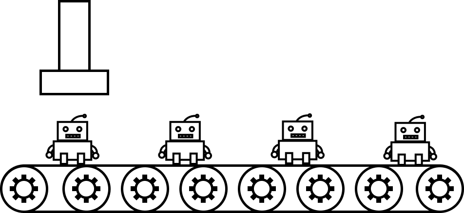

# The JavaScript Factory Pattern
The JavaScript Factory Pattern is a design pattern that allows you to create objects of similar types without explicitly calling a constructor. It encapsulates the creation of objects and hides the implementation details from the client code.




### What is a Factory Pattern?
In software engineering, a Factory is an object that creates other objects. The Factory Pattern is a creational pattern that uses a Factory to create and return objects without exposing the instantiation logic to the client code.

### Why use a Factory Pattern?
Using a Factory Pattern has several advantages over traditional object creation methods:

- Encapsulation: The creation of objects is hidden from the client code, making it easier to modify the creation process without affecting the client code.
- Abstraction: The client code does not need to know the implementation details of the object creation process. It only needs to know the interface of the Factory.
- Flexibility: The Factory can create objects of different types, depending on the input parameters.

### How does the Factory Pattern work?
The Factory Pattern works by defining an interface or a base class for creating objects, and then creating concrete classes that implement the interface or extend the base class. The client code calls the Factory to create objects of the desired type, and the Factory returns a new instance of the concrete class.

Here's an example of a Factory Pattern implementation in JavaScript:

```
// Define the interface for creating objects
class Animal {
  makeSound() {}
}

// Define the concrete classes that implement the interface
class Dog extends Animal {
  makeSound() {
    return 'Woof!';
  }
}

class Cat extends Animal {
  makeSound() {
    return 'Meow!';
  }
}

// Define the Factory that creates objects of the desired type
class AnimalFactory {
  createAnimal(animalType) {
    if (animalType === 'dog') {
      return new Dog();
    } else if (animalType === 'cat') {
      return new Cat();
    }
  }
}

// Usage example
const animalFactory = new AnimalFactory();
const dog = animalFactory.createAnimal('dog');
const cat = animalFactory.createAnimal('cat');

console.log(dog.makeSound()); // Output: Woof!
console.log(cat.makeSound()); // Output: Meow!
```
In this example, we define the ***`Animal`*** interface and two concrete classes that implement the interface ( ***`Dog`*** and ***`Cat`*** ). We also define the AnimalFactory class, which creates objects of the desired type based on the input parameter.

### Conclusion
The JavaScript Factory Pattern is a powerful tool for creating objects of similar types without exposing the implementation details to the client code. It encapsulates the creation of objects and allows you to modify the creation process without affecting the client code. By using the Factory Pattern, you can make your code more flexible, maintainable, and reusable.