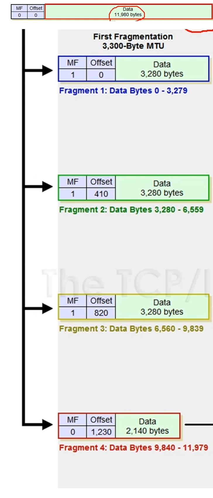

# 네트워크

### 라우팅 테이블

> 라우팅 테이블에 적혀있는 경로를 통해, 네트워크 통신을 한다.
>
> 만일, 테이블에 명시 됐지 않았다면, 경로를 통해 목적지에 갈 수 없다.

- 데이터를 보낼때 

  - | Ethernet | IPv4 | ICMP(0) |
    | :------: | :--: | :-----: |

    1. Ethernet에 있는 MAC주소는 가장 가까운 곳에 보내기 때문에 목적 MAC주소가 아닌, 가장 주변에 있는 게이트웨이에 보냄

    2. 송신한 장치에서 가장 가까운 게이트웨이에서 받은 Ethernet 패킷을 먼저 열어보고, 만일 자기 한테온 패킷이면 상위 계층(3계층) 프로토콜을 열어봄

    3. MAC주소는 맞고, IP주소는 다를 경우 해당 게이트웨이는 본인의 라우팅 테이블을 확인후 패킷에 있는 IP주소로 보낼수 있는 경로로 Ethernet MAC 주소를 수정 후 보냄

       (목적지 까지 반복)

    4. 목적지에 도착할 경우 MAC, IP주소가 전부 본인의 것일 경우 ICMP를 최종적으로 확인

    5. ICMP(8)을 패킷에 실어서 다시 전송, 위 과정을 도착할 때까지 반복

*(cmd 창에서 netstat -r을 입력할 경우 라우팅 테이블을 확인 가능)*

- 같은 네트워크 대역대에서 통신을 할 경우에는 네트워크로 연결이 됐기 때문에 게이트웨이가 없어도 정상적으로 가능하지만, 다른 네트워크 대역으로 넘어가려 하는 경우에는 게이트웨이가 설정 되어 있어야만 게이트웨이를 타고 가서 타 네트워크까지 통신이 가능함

### IPv4 단편화

> 큰 IP패킷은 라우터를 통과할 때 각 라우터마다 적합한 프레임(MTU기준 = 1500 Bytes)으로 변환이 필요하다.
>
> 조각화된 패킷은 최종 목적지에서만 조립이 가능 하며, IPv4에서는 라우터에서도 조각화가 가능했지만, IPv6에서는 송신지에서만 가능하다.

- 단편화를 진행하려면 MTU 범위 내 데이터 + 20Bytes(IPv4프로토콜 크기)

  

  - 단편화 작업을 하고 나서는 MF(More Fragment)에 1로 설정해 이 패킷 다음에 단편화로 쪼갠 데이터가 온다는 것을 알려줌
  - Offset은 단편화 데이터 크기 / 8 부터라고 위치를 알려줌
  - 더이상 단편화 데이터가 없을 경우 MF를 0으로 세팅
  - 위 IP id는 동일함
  - 단편화가 된 다음 Ethernet protocol이 붙음
  - ICMP protocol은 마지막 패킷에만 붙음

### 약어

- **MTU** : Maximum Transfer Unit