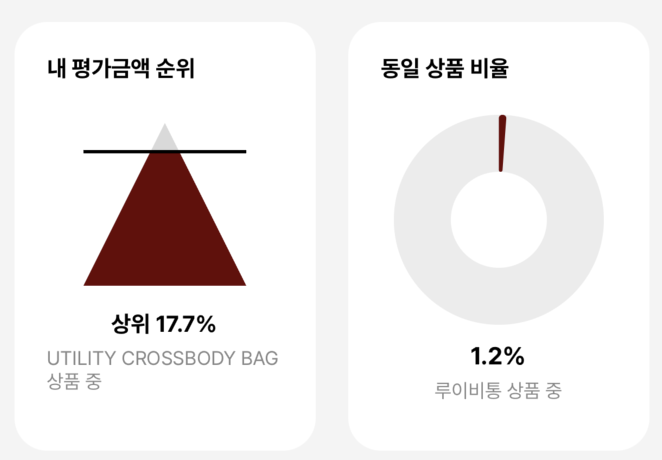

# 업데이트 생존기
이번달에 새로 스크루지 26 기능을 리뉴얼 하고 기존에 사용중인 expo publish가 2024.02월 부터 지원을 중단했기 때문에 배포 방식을 **expo puslish**에서 **eas update**로 이전 했습니다.

또한 다양한 그래프(막대, 선, 삼각형, 도넛)들을 통해 서비스를 운영하면서 쌓인 데이터들을 가공해 유저한테 보일수 있도록 많은 시각화가 이뤄졌습니다

{: width="300"}
도넛그래프

{: width="300"}
라인그래프

{: width="300"}
도형그래프

처음 스크루지 26 업그레이드 기획안을 만들때 기획자분과 같이 React Native third party에서 제공하는 라이브러리가 존재하는지 또, 혼자서 만들수 있는 기능인지 찾아보고 또 사용법을 익히는데 시간이 많이 들었는데요

혼자서 만들기에는 그래프쪽이 많은 러닝 커브가 들어서 대부분 라이브러리를 사용했습니다 만들고 나서 가장 걱정했던 부분은 가지고 있는 기기는 많아야 5종류 밖에 안돼, 다양한 테스트를 진행하기 어려웠는데요

다행히 안드로이드 진영에서 삼성에서 제공하는 기능을 찾아 실제 기기를 remote로 테스트 할 수 있었습니다.
(다양한 삼성 기기를 제공하며 하루에 10개의 Credit을 공짜로 주는데 기기 사용을 위해 30분마다 2개가 필요 합니다.)
https://developer.samsung.com/
{: width="500"}

그리고 애플은 mac에서 사용할수 있는 시뮬레이터를 이용해 테스트를 진행했고요

(Mac OS iPhone Simulator)
{: height="500"}

하.지.만. 늘 그렇듯이 문제는 불현듯이 발생을 합니다….🥲

한 유저로 부터 스크루지 26에서 다음 프로세스로 넘어가는 버튼이 안보인다고 문의가 들어왔습니다.
위 문의를 받자 마자 제가 가지고 있는 모든 테스트 + 개인 기기를 동원해서 확인을 해봐도 정상 작동을 하고 있었습니다.
(제보 감사합니다 고객님 증말 감사합니다 ㅠㅠ)

유저분이 보내주신 캡쳐본을 보고 기기를 유추해 Z Flip이라는걸 확인하였지만 직원들중 아무도 동일 기기를 사용하고 있지 않아서 난황을 격던중remote test lab에서 제공하는 기기가 있다는 걸 떠올리고는 테스트를 해보니 동일 에러가 발생했습니다.

문제가 2가지 였는데
	1.	실제 기기가 없어서 상세한 테스트가 불가능(Samsung remote test lab에서 실제 배포를 해야만 설치하고 확인이 가능)
	2.	다음으로 갈수 있는 버튼은 https://www.npmjs.com/package/@gorhom/bottom-sheet third party 라이브러리를 사용중이라 코드를 하나하나 까서 보는거는 시간상 오래걸림

결국 내린 결론은 “라이브러리를 빼고 직접 Bottom Sheet를 만들자” 였습니다.

다행히 React Native에서 제공하는 여러 기능들이 있어 만드는 데에 러닝커브와 제작 시간이 오래 걸리지 않아 하루만에 완성을 하였고 EAS update로 배포를 한뒤 development로 현재 가지고 있는 기기에서는 문제가 발생하지 않는지 속도 및 성능면에서 문제가 없는지 확인 후 배포를 하였고 다시 Samsung Remote test lab을 이용해 문제가 없는지 확인 후 안심을 하였습니다.

사용된 기술은 react-native-gesture-handler 라이브러리를 사용해서 사용자의 터치 시작지점부터 터치가 끝난 지점까지 y좌표 값이 얼마나 차이가 나는지에 따라 업 스크롤링, 다운 스크롤링을 구분하였고 react-native-reanimated을 통해 애니메이션 및 동작을 핸들링 했습니다.

{: width="300"}

다 만들고 나니 생각보다 잘 만들어진거 같아 혼자만 쓰기 아깝다는 생각이 났습니다.
그래서 NPM을 통해 배포를 해서 동일한 문제를 격은 개발자들을 위해 배포를 할 예정입니다.

***결론***
라이브러리는 양날의 칼이다… 아퍼요...
